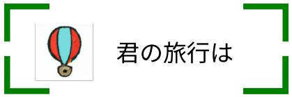

# Team Project 君の旅行は? - 3 組 イクゾ

  

 

## 👨🏻‍🤝‍👨🏻 Authors

- [@SHIN MINGYU](https://github.com/SHIN-MINGYU) - AR / FRONT / BACK
- [@Defiler1](https://github.com/Defiler1) - FRONT / UI
   
   

## 🔨 Tech Stack

- FrontEnd : Next.JS, TAILWIND CSS, StyledComponents, Typescript
- BackEnd : Next.JS, MySql, Python, Unity
- Deploy : VERCEL, AWS
- External Api : TMAP API, Amadeus
   
   

# ✨ プロジェクト紹介

여행을 가고싶지만 여행계획부터 짜기 귀찮은 사람들을 여행도우미 서비스 입니다.
 
 

# プロジェクトの主な機能

- [📅 プラン生成](#-プラン生成)
- [👨‍👨‍👦‍👦 コミュニティ](#-コミュニティ)
- [🥽AR-ナビゲーション](#-AR-ナビゲーション)
   
   

## 📅 プラン生成

 

### プラン生成 step.1

여행날짜 선택

 

### プラン生成 step.2

여행지 선택 및 자신이 원하는 여행 카테고리 선택
 

 

### プラン生成 step.3

여행경비 설정

 

### プラン生成 結果

한국관광공사의 TOUR API를 이용하고, 개인화 추천 알고리즘을 통하여 여행지를 추천해줍니다.
 
여행지가 마음에 안들면 재생성 버튼을 눌러서 여행지 재생성이 가능합니다.

 
 

## 👨‍👨‍👦‍👦 コミュニティ

 

자신이 여행한 여행지를 공유하고 다른 사람들의 여행지를 볼 수 있는 커뮤니티 입니다.

 
 

## 🥽AR-ナビゲーション

 

## comming soon...

 
 

<h1>📚 STACKS</h1>

 
   
  <!-- 사용한 언어 HTML, CSS, JAVASCRIPT, PYTHON -->
   
   
   
   
   
  
  <!-- 프론트 프레임워크 NEXT.JS, REACT, TAILWIND CSS, styledcomponents -->
   
   
   
   
  
  <!-- 백 프레임워크 NEST JS, DJANGO, UNITY -->
  
  
  
   
  
  <!-- DB및 배포 MY SQL, AWS, vercel -->
   
   
   
   

<!-- 유틸리티  GITHUB, GIT, SLACK  -->
  
  
  
   
   
   
   

